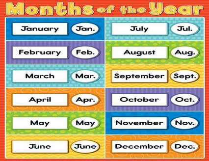

January[ˈdʒænjueri] :January is the first month of the year .

February [ˈfebrueri] :February is the second month of the year.

March:March is the third month of the year.

April:April is the forth month of the year.

May: May is the fifth month of the year.

June [dʒuːn] : June is the sixth month of the year.

July  [dʒuˈlaɪ] : July is the seventh month of the year.

August  [ˈɔːɡəst]: August is the eighth month of the year.

September [sepˈtembər] : September is the ninth month of year.

October  [ɑːkˈtoʊbər]: October is the tenth month of year.

November  [noʊˈvembər] : November is the eleventh month of year.

December [dɪˈsembər] : December is the twelfth month of year.